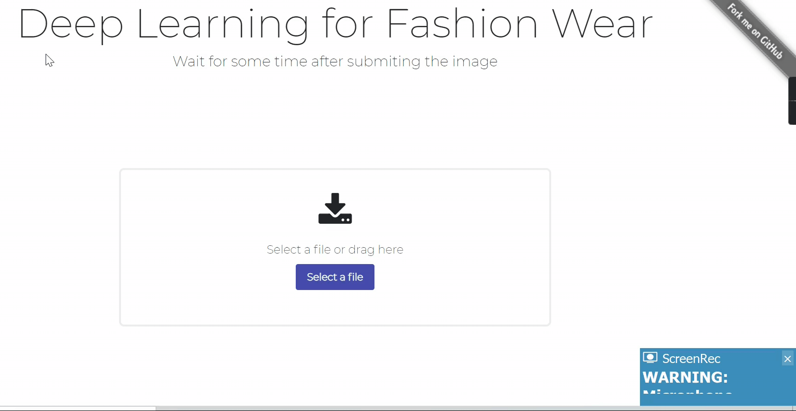

<h1 align="center">Welcome to FashionWear 👋</h1>
<p>
  
  <a href="#" target="_blank">
    
  </a>
</p>

# A Deep Learning Model to classify the fashion wear and also detect them.



### ✨ [Demo](https://fashionwear.netlify.app/)

## Install & Working with system setup

```sh
# First clone this repository using given command:
git clone https://github.com/devil-cyber/FashionWear

# Now setup your python enivornment using conda or env
conda create -n [Enivornment Name] python=3.6.9

# Now go inside app folder in project directory using given command:
cd app

# Now install all the required library using given command:
pip install -r requirements.txt

# To run the app locally make a samll change inside 'clientApp.py' 
port = int(os.getenv("PORT")) # replace this code with below code
port = 5000

# It's time to run our app:
python clientApp.py


```

## Now open postman and hit the url `http://localhost:5000/predict` and provide image in base64 format 
> You can also convert image to base64 from [here](https://base64.guru/converter/encode/image)

> For more details you can wait for my youtube video


## Motivation
>We live in the age of Instagram, YouTube, and Twitter. Images and video (a sequence of images) dominate the way millennials and other weirdos consume information.Having models that understand what images show can be crucial for understanding your emotional state (yes, you might get a personalized Coke ad right after you post your breakup selfie on Instagram), location, interests and social group.Predominantly, models that understand image data used in practice are (Deep) Neural Networks. Here, we’ll implement a Neural Network image classifier from scratch in Python.

## Author

👤 **Manikant Kumar**

* Website: https://devil-cyber.github.io/CodingSpace/
* Github: [@devil-cyber](https://github.com/devil-cyber)
* LinkedIn: [@manikant-kumar-550998192\/](https://linkedin.com/in/manikant-kumar-550998192\/)

## Show your support

Give a ⭐️ if this project helped you!

***
_This README will need saome update
